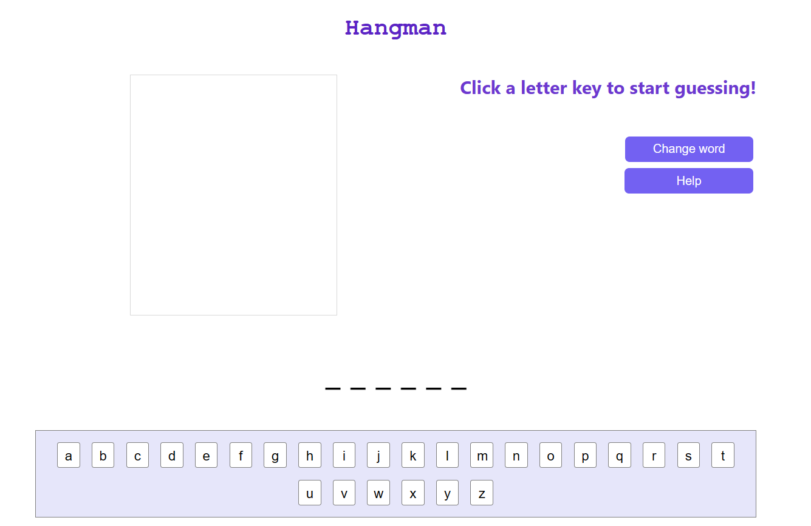
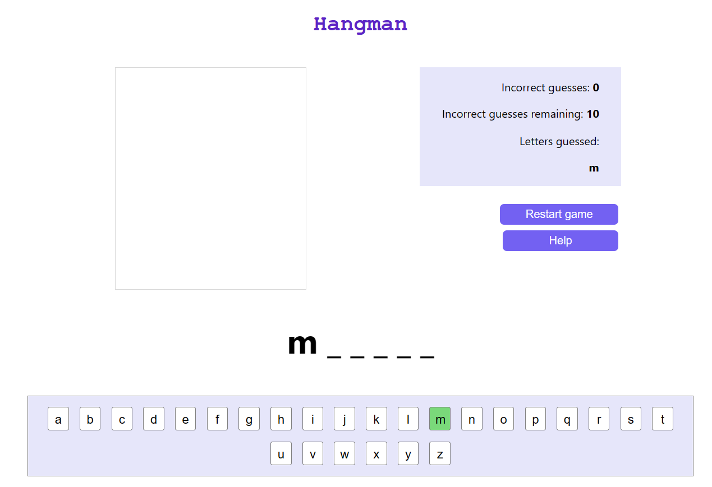
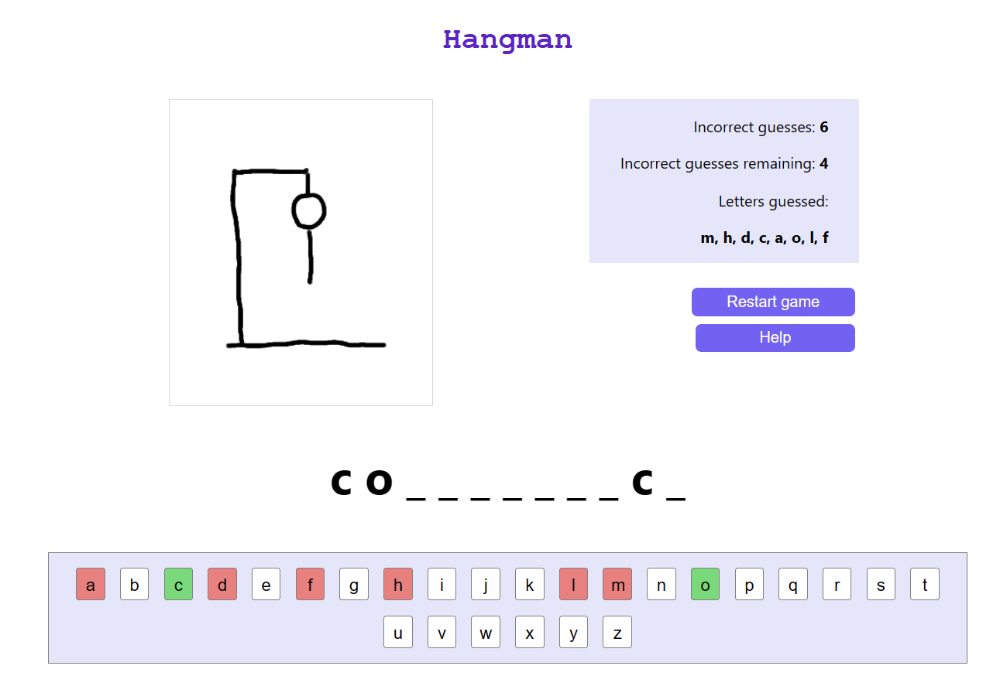
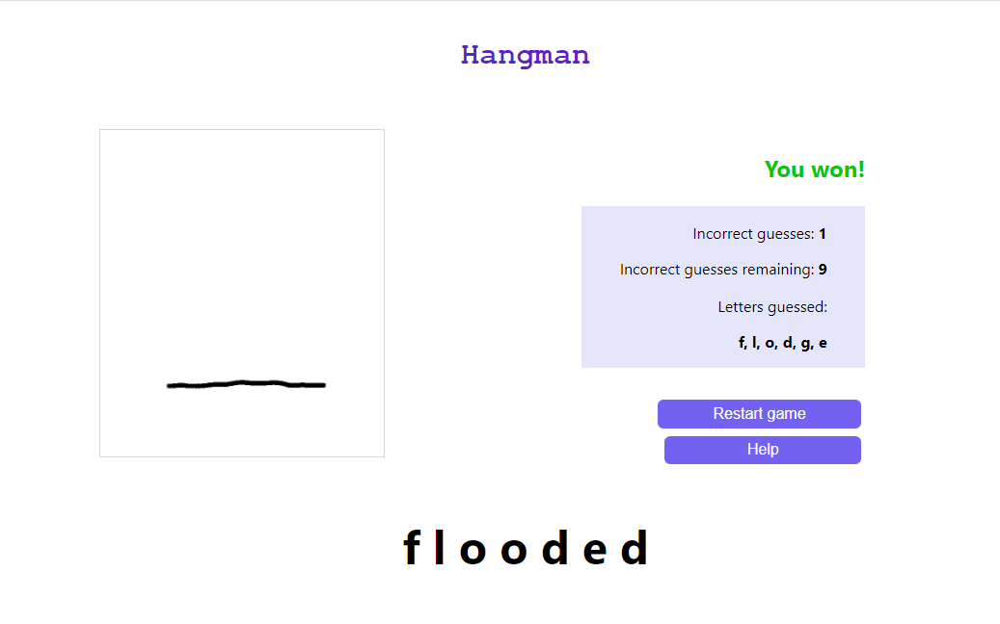
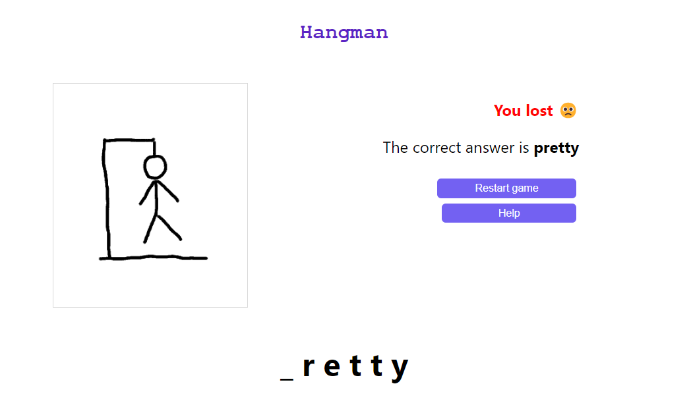

# HANGMAN

**This is a single-player game to guess a random word correctly by guessing letters.**

## CONTENTS:

1. INSTALLATION
2. USAGE

   2.1. HOW TO PLAY

   2.2. HOW TO WIN

## 1. INSTALLATION

1. Open the command line prompt.
2. Type cd (change directory) and then navigate to or paste the file path to the Hangman folder. Ensure the path name for the folder is where the package.json file is located. Press enter to change to this directory.
3. Type 'npm install' (no quotation marks) and then press enter
4. Once it has finished installing, type 'npm start' into the command line.
5. A tab should then open in your browser (may take up to a minute or so) and you can then start the game.

## 2. USAGE

### 2.1. HOW TO PLAY

- Click on any letter button to start guessing a letter and start the game. It should look like this:

  

- If you want to choose a different word to guess (e.g. it's too long), click 'Change word'.

- The word to be guessed is displayed above the keyboard. Its letters are represented with underscores at the start of the game or if not yet guessed correctly.
- If you make a correct guess, the correct letter(s) are revealed in the word display. The number of guesses remaining will stay the same. Here is an example of a correct guess:

- Dashes or spaces do not need to be guessed and are already visible in the word display.

- However, every time you make an incorrect guess, you are one step closer to the man being hanged! You will notice your 'incorrect guesses remaining' count go down. See the following screenshots of the game in action:

  

### 2.2. HOW TO WIN

- Win by guessing all the letters in the word within 9 or less incorrect guesses.
- When you have guessed the whole word, the game will end and you will see a 'You won!' message:
  

- If you didn't guess the word within the number of incorrect guesses allowed, you will see a 'You lose' message and the correct answer:

  

- Once the game has ended, click 'Restart game' to play again.
- Click Help to read through instructions and rules.
